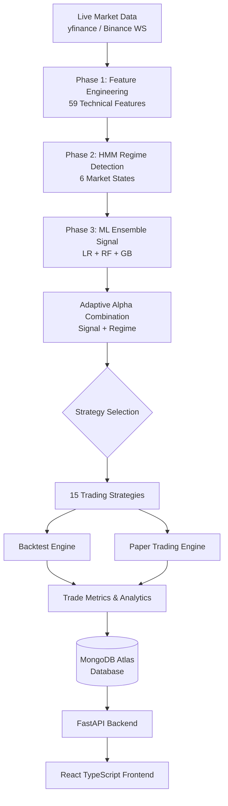

<div align="center">
  
  <h1>QuantWise v3</h1>
  <p><strong>AI-Powered Quantitative Trading Intelligence Platform</strong></p>
  
  [](https://www.python.org/)
  [](https://fastapi.tiangolo.com/)
  [](https://reactjs.org/)
  [](https://www.mongodb.com/)
  [](https://opensource.org/licenses/MIT)
  []()
</div>

<br />

## 📑 Table of Contents
- [Overview](#-overview)
- [Live Demo](#-live-demo)
- [Features](#-features)
- [Architecture](#-architecture)
- [Tech Stack](#-tech-stack)
- [Core ML System](#-core-ml-system)
  - [Phase 1: Feature Engineering](#phase-1---feature-engineering)
  - [Phase 2: 6-State HMM Regime Detection](#phase-2---6-state-hmm-regime-detection)
  - [Phase 3: ML Ensemble Signal](#phase-3---ml-ensemble-signal)
- [Backtest Results](#-backtest-results)
- [15 Trading Strategies](#-15-trading-strategies)
- [Paper Trading System](#-paper-trading-system)
- [Frontend Pages](#-frontend-pages)
- [API Endpoints](#-api-endpoints)
- [How to Run](#-how-to-run)
- [Environment Variables](#-environment-variables)
- [Project Structure](#-project-structure)
- [Screenshots](#-screenshots)
- [Roadmap](#-roadmap)
- [Academic Info](#-academic-info)
- [License](#-license)

---

## 📖 Overview
**QuantWise** is an end-to-end quantitative trading research and paper trading platform that combines advanced machine learning with classical quantitative finance theory to generate alpha-beating investment signals on the **NIFTY 50** and **S&P 500** indices.

Built for individual investors, students/researchers, and hedge funds, QuantWise provides real-time market data, AI-driven regime detection, complex multi-strategy backtesting, and live paper trading environments.

## 🚀 Live Demo
**Coming Soon**

## ✨ Features
- **Real-Time Data**: Live market data feed via Yahoo Finance and Binance WebSocket API.
- **Advanced Machine Learning**: 3-phase ML pipeline with 59 engineered features, Gaussian HMM regime detection, and ML ensemble models.
- **15 Trading Strategies**: From classic moving average crossovers to multi-timeframe momentum and volatility-adjusted trend systems.
- **Paper Trading Engine**: Realistic paper trading simulator with intraday/delivery options, brokerage cost simulation, and detailed performance analytics.
- **Stunning UI/UX**: React 18 application with Tailwind CSS, Framer Motion animations, and 3D visualizations.
- **Comprehensive Analytics**: Deep dive into cumulative P&L, strategy win rates, confidence calibration, and regime-based performance.

## 🏛 Architecture



## 💻 Tech Stack

| Category | Technologies |
| :--- | :--- |
| **Frontend** | React 18, TypeScript, Tailwind CSS, Framer Motion, Three.js, Recharts, Lightweight Charts (TradingView), React Query, Shadcn/ui, Lucide React |
| **Backend** | Python, FastAPI, Uvicorn |
| **Database** | MongoDB Atlas (Cloud), SQLite (Local Fallback) |
| **ML/AI** | scikit-learn, hmmlearn, numpy, pandas, statsmodels, ta (technical analysis) |
| **Data Sources** | yfinance (Yahoo Finance), Binance WebSocket API |
| **Charting** | Lightweight Charts by TradingView |

## 🧠 Core ML System
The system utilizes a sophisticated 3-phase machine learning pipeline to generate trading signals and optimize strategy selection.

### Phase 1 - Feature Engineering
- Downloads OHLCV data from Yahoo Finance.
- Engineers **59 technical features** per index including returns, volatility (10/20/50 day), trend indicators, momentum, risk, Bollinger Bands, multi-timeframe returns, and volume features.
- Employs a smart NaN filling strategy without dropping rows to recover all available historical data.

### Phase 2 - 6-State HMM Regime Detection
Trains a Gaussian Hidden Markov Model independently per index to classify the market into 6 states:
1. **Strong Bull** (High return, low volatility)
2. **Weak Bull** (Moderate return, medium volatility)
3. **Strong Sideways** (Near-zero return, low volatility)
4. **Weak Sideways** (Near-zero return, high volatility)
5. **Weak Bear** (Small negative return, medium volatility)
6. **Strong Bear** (Large negative return, high volatility)

Features:
- Regime smoothing with a minimum 10-day streak requirement.
- Data-driven strategy selection: For each regime, the system finds which strategy achieves the highest Sharpe ratio on *only* that regime's days.
- **HMM Confidence Weighting**: Uses `predict_proba()`. Daily returns are a weighted sum across all 6 states based on regime probability.

### Phase 3 - ML Ensemble Signal
- Target: Predict if the next day's return > 0.
- 3 models in ensemble: Logistic Regression, Random Forest, Gradient Boosting.
- Final signal is the average probability of all 3 models.
- **Adaptive Alpha Combination**: Dynamically scales the weight of the ML signal vs. Regime-Aware strategy based on a 30-day rolling ML accuracy metric.

## 📊 Backtest Results

### NIFTY 50 (2007-2025)
| Strategy | Annualized Return | Sharpe Ratio |
| :--- | :--- | :--- |
| **Combined_v3 (Best)** | **39.91%** | **0.91** |
| ML_Signal | 36.33% | 0.88 |
| Regime_Aware_v3 | 34.64% | 0.85 |
| Buy & Hold (Benchmark) | 10.39% | 0.345 |

*ML Model Accuracy: 54.2%*

### S&P 500 (2000-2025)
| Strategy | Annualized Return | Sharpe Ratio |
| :--- | :--- | :--- |
| **Combined_v3 (Best)** | **~35.00%** | **-** |
| Buy & Hold (Benchmark) | 6.15% | 0.153 |

*ML Model Accuracy: 53.3%*

## 📈 15 Trading Strategies

| Strategy Category | Strategies Included |
| :--- | :--- |
| **Original Baseline (10)** | `Buy_Hold`, `SMA_Crossover`, `EMA_Crossover`, `RSI_Mean_Rev`, `MACD_Trend`, `Breakout`, `Vol_Breakout`, `Bollinger_Bands`, `Momentum`, `Defensive_Cash`, `Risk_Parity` |
| **Phase 1 High-Alpha (4)** | `Dual_Momentum` (Trend filter + absolute momentum), `MTM` (Multi-Timeframe composite), `ZScore_MeanRev` (Statistically grounded mean reversion), `VATR` (Volatility-Adjusted Trend) |

## 💸 Paper Trading System
- Live market data via `yfinance` (15-min delayed).
- Real-time regime detection and signal generation on live data.
- **Confidence Scores**: HMM confidence + ML confidence weighted together.
- Risk Levels: LOW (>65%), MEDIUM (>50%), HIGH (<50%).
- Trade Types: Intraday and Delivery.
- Simulated Costs: Brokerage Rs20 + STT 0.1%.
- Risk Management: Stop loss at `entry - 2x ATR`, target at `entry + 3x ATR`.
- MongoDB Atlas integration for persistent trade tracking.

## 🖥 Frontend Pages

| User Type | Available Pages |
| :--- | :--- |
| **Individual Investor** | Dashboard, Backtest, Regime Analysis, Strategy Comparison, Simulation, Paper Trading, Trading History, Analytics |
| **Student / Researcher** | Dashboard, Interactive Learn (HMM/Strategies), Research Lab, Saved Experiments, Strategy Library |
| **Organization / Hedge Fund** | Executive Dashboard, Analytics, API Access, Bulk Backtesting, Risk Report, Team Management, Export Results |

## 🔌 API Endpoints

| Method | Endpoint | Description |
| :--- | :--- | :--- |
| GET | `/` | Service info |
| GET | `/health`, `/db-health` | Health checks and MongoDB status |
| POST | `/backtest` | Run full ML pipeline backtest |
| GET | `/regime` | Get current market regime |
| GET | `/strategies` | Get all strategy returns |
| POST | `/simulate` | Investment growth simulator |
| GET | `/live-prices`, `/live-price/{index}` | Live index prices |
| GET | `/live-signal`, `/live-signal/{index}` | Live signals with confidence scores |
| POST | `/paper-trade/open`, `/close` | Open/Close paper trades |
| GET | `/paper-trade/positions`, `/history`, `/metrics` | Paper trading analytics and history |

## 🛠 How to Run

### Backend (ml-service)
```bash
cd ml-service
pip install -r requirements.txt
python -m uvicorn main:app --reload
```
API runs at `http://127.0.0.1:8000` | Docs at `http://127.0.0.1:8000/docs`

### Frontend (React)
```bash
cd Frontend
npm install
npm run dev
```
App runs at `http://localhost:5173`

## ⚙️ Environment Variables

Create a `.env` file in the **Frontend** directory:
```env
VITE_API_URL=http://127.0.0.1:8000
```

Create a `.env` file in the **ml-service** directory:
```env
MONGO_URI=your_mongodb_connection_string
```

## 📁 Project Structure

```text
quantwise/
├── Frontend/                 # React TypeScript app
│   ├── src/
│   │   ├── components/       # Reusable UI components (charts, landing, layout)
│   │   ├── pages/            # Individual, Student, and Organization routes
│   │   ├── api/              # Axios API calls
│   │   ├── hooks/            # React Query hooks
│   │   ├── context/          # Context API (Auth)
│   │   └── types/            # TypeScript interfaces
│   ├── package.json
│   └── vite.config.ts
├── ml-service/               # Python FastAPI backend
│   ├── main.py               # FastAPI app + endpoints
│   ├── config.py             # Shared constants
│   ├── data_engineering.py   # 59 feature engineering
│   ├── hmm_engine.py         # 6-state HMM regime detection
│   ├── ml_model.py           # ML ensemble model
│   ├── strategies.py         # 15 trading strategies
│   ├── backtest_engine.py    # Simulator + metrics
│   ├── live_data.py          # yfinance live data
│   ├── signal_engine.py      # Live signal generation
│   ├── paper_trade_engine.py # Paper trading logic
│   ├── trade_metrics.py      # Performance metrics
│   ├── database.py           # MongoDB connection
│   └── requirements.txt
├── Backend/                  # Reserved for future use
├── Docs/                     # Documentation
└── README.md
```

## 📸 Screenshots
*(Coming Soon - Placeholders for application screenshots)*

## 🗺 Roadmap
- [ ] Implement multi-asset portfolio optimization (Markowitz).
- [ ] Add deep learning models (LSTM / Transformers) to the ensemble.
- [ ] Introduce options trading capabilities in the paper trading simulator.
- [ ] Implement user authentication and JWT authorization.

## 🎓 Academic Context
This is a Major Project for B.E. Computer Engineering at the **Sardar Patel Institute of Technology (SPIT)**, Mumbai.
- **Academic Year**: 2025-2026
- **Student**: Ronit Sonawane

## 📄 License
This project is licensed under the [MIT License](https://opensource.org/licenses/MIT).
