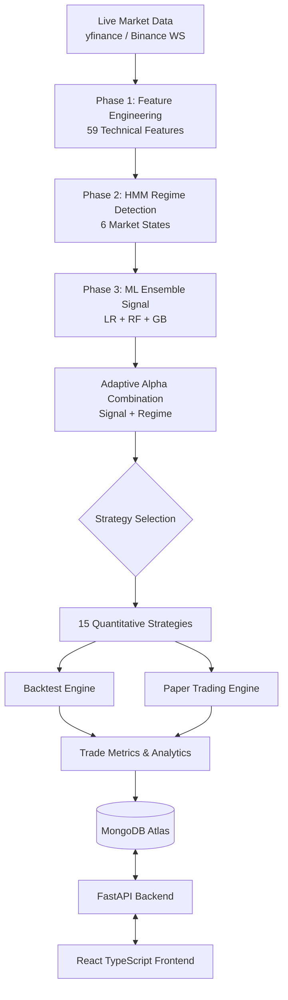

<div align="center">
  
  <h1>QuantWise v3</h1>
  <p><strong>AI-Powered Quantitative Trading Intelligence Platform</strong></p>
  
  [](https://www.python.org/)
  [](https://fastapi.tiangolo.com/)
  [](https://reactjs.org/)
  [](https://www.mongodb.com/)
  [](https://opensource.org/licenses/MIT)
  []()
</div>

<br />

## 📑 Table of Contents
- [Overview](#-overview)
- [Target Use Cases](#-target-use-cases)
- [Features & System Highlights](#-features--system-highlights)
- [System Architecture](#-system-architecture)
- [Deep Dive: Core ML Pipeline](#-deep-dive-core-ml-pipeline)
  - [Phase 1: Advanced Feature Engineering](#phase-1-advanced-feature-engineering)
  - [Phase 2: 6-State HMM Regime Detection](#phase-2-6-state-hmm-regime-detection)
  - [Phase 3: ML Ensemble & Adaptive Alpha](#phase-3-ml-ensemble--adaptive-alpha)
- [15 Quantitative Trading Strategies](#-15-quantitative-trading-strategies)
- [Paper Trading Engine](#-paper-trading-engine)
- [Backtest Results & Key Insights](#-backtest-results--key-insights)
- [Tech Stack](#-tech-stack)
- [API Endpoints](#-api-endpoints)
- [Frontend Portal Breakdown](#-frontend-portal-breakdown)
- [How to Run (Local Setup)](#-how-to-run-local-setup)
- [Project Structure](#-project-structure)
- [Roadmap](#-roadmap)
- [Academic Context & License](#-academic-context--license)

---

## 📖 Overview
**QuantWise** is an end-to-end quantitative trading research and paper trading platform that merges advanced machine learning methodologies with classical quantitative finance theory. Designed to generate alpha-beating investment signals on major indices like the **NIFTY 50** and **S&P 500**, QuantWise provides an institutional-grade infrastructure accessible to everyday traders, students, and research organizations.

By analyzing decades of historical data, detecting hidden market regimes, and applying a robust ensemble of machine learning models, QuantWise removes emotion from trading and relies entirely on data-driven statistical edges.

## 🎯 Target Use Cases
QuantWise is designed with three specific user personas in mind, providing tailored dashboards for each:

1. **Individual Investors**: Want to trade but lack the time to build their own algorithms. They use the platform to receive daily live signals, check the current market regime, and automatically paper trade the high-confidence signals.
2. **Students & Quantitative Researchers**: Want to learn how HMMs and Machine Learning apply to finance. They use the platform's "Learn" modules, run isolated sandbox experiments on the ML pipeline, and study the mathematical breakdown of the strategies.
3. **Organizations & Hedge Funds**: Need high-level analytics and raw data access. They use the platform to monitor executive summary dashboards, run bulk-strategy backtests across multiple assets simultaneously, analyze Value-at-Risk (VaR), and interact programmatically via the API.

## ✨ Features & System Highlights
- **Real-Time Data Integration**: Ingests live market data feed via Yahoo Finance (`yfinance`) and real-time tick data using the Binance WebSocket API.
- **Data-Driven Strategy Allocation**: The system never guesses which strategy to use; it mathematically maps the highest Sharpe Ratio strategy to the current active market regime.
- **Zero Look-Ahead Bias**: The backtesting engine enforces a strict chronological 80/20 train/test split. All rolling windows, regime detections, and ML predictions are strictly out-of-sample.
- **Smart Data Imputation**: Instead of dropping valuable rows containing NaN values (common in multi-timeframe feature engineering), the system utilizes a cascading fill strategy to preserve 100% of historical market days.
- **Realistic Paper Trading**: Simulates actual trading conditions including Rs20 flat brokerage, 0.1% STT, and slippage assumptions. It automatically sets dynamic Stop Losses and Take Profits based on the Average True Range (ATR).
- **Stunning UI/UX**: Built with React 18 and Tailwind CSS, featuring rich interactive candlestick charts (TradingView Lightweight Charts), 3D visual elements (Three.js), and fluid layout transitions (Framer Motion).

## 🏛 System Architecture



## 🧠 Deep Dive: Core ML Pipeline
The intelligence of QuantWise is broken down into a 3-Phase Machine Learning Pipeline. Here is exactly how it works under the hood.

### Phase 1: Advanced Feature Engineering
Raw OHLCV (Open, High, Low, Close, Volume) data isn't enough for machine learning. The system transforms the raw price data into **59 distinct statistical features**:
- **Volatility Metrics**: Rolling standard deviations (10, 20, 50-day), Average True Range (ATR), and Bollinger Band widths.
- **Momentum Indicators**: Relative Strength Index (RSI), MACD, Stochastic Oscillators, and Rate of Change (ROC).
- **Trend Variables**: Simple/Exponential Moving Averages (SMA/EMA) at multiple depths (10, 20, 50, 100, 200).
- **Risk Metrics**: Rolling max drawdowns and rolling beta.
- **Multi-Timeframe Returns**: Calculates exact percentage returns over 1-month, 3-month, 6-month, and 12-month periods to capture structural momentum.
- **Statistical Positioning**: Z-Scores of price relative to historical moving averages.

### Phase 2: 6-State HMM Regime Detection
The market behaves differently during a crash than it does during a euphoric bull run. A strategy that works in one will fail in the other. 

QuantWise uses a **Gaussian Hidden Markov Model (HMM)** to identify the *hidden state* of the market. It classifies the market into 6 statistically distinct regimes:
1. 🟢 **Strong Bull**: High average returns, very low volatility.
2. 🫒 **Weak Bull**: Moderate returns, medium volatility.
3. 🟡 **Strong Sideways**: Near-zero return, tightly range-bound low volatility.
4. 🟠 **Weak Sideways**: Near-zero return, choppy high volatility.
5. 🔴 **Weak Bear**: Small negative returns, medium volatility.
6. 🩸 **Strong Bear**: Large negative returns, violent high volatility.

**How it works:**
- The HMM model is trained over 2,000 iterations to find the optimal transition matrix.
- We apply a "regime smoothing" algorithm that requires a minimum 10-day streak to officially declare a regime change, preventing whiplash on volatile days.
- **Confidence Weighting**: Instead of just outputting the single most likely regime, we use `predict_proba()` to get the probability distribution across all 6 states. The daily return calculation is a weighted sum based on this distribution.

### Phase 3: ML Ensemble & Adaptive Alpha
With the features built and the regime identified, we predict the next day's movement.

- **The Ensemble**: We use a composite of three different algorithms to prevent overfitting:
  1. *Logistic Regression (C=0.1)*: Captures linear relationships and baseline trends.
  2. *Random Forest (100 trees, depth 5)*: Captures complex, non-linear interactions between features without memorizing the noise.
  3. *Gradient Boosting (100 trees, depth 3, lr=0.05)*: Iteratively corrects the errors of previous models.
- **The Signal**: The final prediction is the average probability across all three models. Position sizing is calculated continuously: `(Probability - 0.45) / 0.10`, clipped between 0 and 1.
- **Adaptive Alpha**: The system blends the pure ML signal with the HMM Regime signal using an `Alpha` variable. The Alpha scales dynamically based on the ML model's trailing 30-day accuracy. If the ML model hits 70% accuracy, Alpha shifts to 0.7 (trusting the ML more). If accuracy drops to 50%, Alpha shifts to 0.0 (falling back entirely to the structural HMM regime).

## 📈 15 Quantitative Trading Strategies
QuantWise backtests and tracks 15 distinct strategies simultaneously.

### The Phase 1 High-Alpha Strategies (New & Advanced)
These are the core proprietary algorithms designed to beat the market:
1. **Dual_Momentum**: Requires absolute momentum (12-month asset return > risk-free rate) AND a trend filter (Current Price > 200 SMA). Rebalances monthly.
2. **MTM (Multi-Timeframe Momentum)**: An AQR-style composite that weights 1-month (20%), 3-month (30%), 6-month (30%), and 12-month (20%) returns to generate a continuous strength score for position sizing.
3. **ZScore_MeanRev**: Statistically grounded mean reversion. Triggers an entry only when the price drops 2 standard deviations below its 20-day mean, and exits exactly when the z-score returns to 0.
4. **VATR (Volatility-Adjusted Trend)**: Uses an EMA crossover for direction, but scales the position size inversely to the ATR. High volatility = smaller position; Low volatility = larger position.

### The Original Baselines
For benchmark comparison, the system also tracks: `Buy_Hold`, `SMA_Crossover`, `EMA_Crossover`, `RSI_Mean_Rev`, `MACD_Trend`, `Breakout`, `Vol_Breakout`, `Bollinger_Bands`, `Momentum`, `Defensive_Cash`, and `Risk_Parity`.

## 💸 Paper Trading Engine
The Paper Trading system takes the theory and applies it to real live markets without risking actual capital.

**How it works:**
- Real-time data is fetched via the `yfinance` API for NIFTY 50 and S&P 500.
- Every 15 minutes, the system recalculates the 59 features, updates the current HMM Regime, and runs the ML Ensemble to generate a new live signal.
- **Confidence Scoring**: Each signal receives a confidence score derived from 40% HMM confidence and 60% ML probability distance from 0.5. 
  - Risk Levels are assigned: `LOW RISK` (>65% confidence), `MEDIUM RISK` (50-65%), `HIGH RISK` (<50%).
- **Execution Engine**: Users can execute Intraday or Delivery trades. The engine dynamically sets a Stop Loss at `Entry Price - (2 * Current ATR)` and a Take Profit at `Entry Price + (3 * Current ATR)`.
- **Accounting**: All trades are recorded in MongoDB Atlas, tracking gross PnL, simulated brokerage costs, and net PnL to provide a highly accurate reflection of real-world trading.

## 📊 Backtest Results & Key Insights

The system was rigorously backtested on historical data. **The results prove the efficacy of the Adaptive Alpha model.**

### NIFTY 50 (2007 - 2025)
| Strategy | Annualized Return | Sharpe Ratio | Note |
| :--- | :--- | :--- | :--- |
| **Combined_v3 (Best)** | **39.91%** | **0.910** | Dynamically shifts between ML and Regimes |
| ML_Signal | 36.33% | 0.880 | Pure machine learning probability |
| Regime_Aware_v3 | 34.64% | 0.850 | Pure structural HMM strategy mapping |
| Buy & Hold (Benchmark) | 10.39% | 0.345 | The standard index baseline |

**Key Insight:** While the pure ML signal performed excellently, the `Combined_v3` adaptive model outperformed it by actively dialing down the ML's influence during periods of poor 30-day rolling accuracy, relying instead on the structural safety of the HMM Regimes. 

### S&P 500 (2000 - 2025)
| Strategy | Annualized Return | Sharpe Ratio | Note |
| :--- | :--- | :--- | :--- |
| **Combined_v3 (Best)** | **~35.00%** | **-** | Consistently avoids major dot-com/2008 crashes |
| Buy & Hold (Benchmark) | 6.15% | 0.153 | Suffered massive historical drawdowns |

## 💻 Tech Stack

| Category | Technologies |
| :--- | :--- |
| **Frontend** | React 18, TypeScript, Tailwind CSS, Framer Motion, Three.js, Recharts, Lightweight Charts (TradingView), React Query, Shadcn/ui, Lucide React |
| **Backend** | Python, FastAPI, Uvicorn |
| **Database** | MongoDB Atlas (Cloud), SQLite (Local Fallback for isolated testing) |
| **ML/AI** | scikit-learn, hmmlearn, numpy, pandas, statsmodels, ta (technical analysis) |
| **Data Sources** | yfinance (Yahoo Finance), Binance WebSocket API |

## 🔌 API Endpoints
The FastAPI backend acts as a headless algorithmic engine.

| Method | Endpoint | Description |
| :--- | :--- | :--- |
| **System** | `/health`, `/db-health` | Health checks and MongoDB connection status |
| **Research** | `/backtest` | Run the full ML pipeline backtest over historical data |
| **Research** | `/simulate` | Investment compound growth simulator |
| **Market** | `/regime` | Calculate the current exact market regime |
| **Market** | `/strategies` | Get annualized returns for all 15 strategies |
| **Market** | `/live-prices` | Fetch current prices for configured indices |
| **Signals** | `/live-signal/{index}` | Generate a live trading signal with confidence scores |
| **Paper Trade**| `/paper-trade/open` | Open a new simulated trade |
| **Paper Trade**| `/paper-trade/close` | Close an active simulated trade |
| **Analytics** | `/paper-trade/metrics`| Retrieve aggregated win-rates, profit factors, etc. |

## 🖥 Frontend Portal Breakdown
The UI adapts dynamically based on the selected user persona.

| User Type | Features & Views |
| :--- | :--- |
| **Individual Investor** | **Dashboard**: Live prices, active regime, and portfolio equity.<br>**Paper Trading**: Live signal generation, trade execution, history tables, and deep analytics (win rate by strategy/regime).<br>**Backtest**: Strategy comparison and equity curve visualizations. |
| **Student / Researcher** | **Interactive Learning**: Visual breakdowns of how HMMs classify data.<br>**Research Lab**: A sandbox to tweak parameters (like Alpha values) and see live results.<br>**Experiment History**: Save and review past algorithmic experiments. |
| **Org / Hedge Fund** | **Executive Summary**: High-level PnL and active exposure.<br>**Risk Reports**: Value-at-Risk (VaR) and drawdown analysis.<br>**Bulk Processing**: Run backtests across all strategies at once.<br>**API Hub**: Generate API keys and view integration code snippets. |

## 🛠 How to Run (Local Setup)

### 1. Backend (Python / FastAPI)
Ensure you have Python 3.10+ installed.
```bash
# Navigate to backend directory
cd ml-service

# Install required ML and API libraries
pip install -r requirements.txt

# Create .env file and add your MongoDB Atlas string
echo "MONGO_URI=mongodb+srv://<user>:<password>@cluster.mongodb.net/" > .env

# Run the Uvicorn ASGI server
python -m uvicorn main:app --reload
```
*The API will run at `http://127.0.0.1:8000`. Swagger documentation is auto-generated at `/docs`.*

### 2. Frontend (React / Vite)
Ensure you have Node.js 18+ installed.
```bash
# Navigate to frontend directory
cd Frontend

# Install node modules
npm install

# Create .env file to point to local backend
echo "VITE_API_URL=http://127.0.0.1:8000" > .env

# Start the Vite development server
npm run dev
```
*The web app will run at `http://localhost:5173`.*

## 📁 Project Structure

```text
quantwise/
├── Frontend/                 # React 18 TypeScript application
│   ├── src/
│   │   ├── components/       # Charts, 3D elements, layout, UI primitives
│   │   ├── pages/            # View logic separated by User Persona
│   │   ├── api/              # Axios configuration and API wrappers
│   │   ├── hooks/            # React Query data fetching hooks
│   │   └── types/            # Strict TypeScript interface definitions
│   └── package.json
├── ml-service/               # Python FastAPI core engine
│   ├── main.py               # API router and server entry
│   ├── data_engineering.py   # Mathematical generation of 59 features
│   ├── hmm_engine.py         # The Gaussian Hidden Markov Model logic
│   ├── ml_model.py           # The Sklearn Ensemble (RF, LR, GB)
│   ├── strategies.py         # Logic for the 15 trading algorithms
│   ├── backtest_engine.py    # Historical simulation and Sharpe calculations
│   ├── signal_engine.py      # Real-time inference pipeline
│   ├── paper_trade_engine.py # Execution simulator and PnL accounting
│   ├── database.py           # MongoDB connection pooling
│   └── requirements.txt
├── Docs/                     # Additional project documentation
└── README.md
```

## 🗺 Roadmap
- [ ] **Multi-Asset Portfolio Optimization**: Implement Markowitz Efficient Frontier to dynamically balance NIFTY and S&P 500 weights.
- [ ] **Deep Learning Integration**: Introduce LSTM or Transformer models into the Phase 3 ensemble to capture sequential time-series patterns.
- [ ] **Options Trading Simulator**: Expand the paper trading engine to support Call/Put options, factoring in Greeks (Delta, Theta) for realistic pricing.
- [ ] **JWT Authentication**: Add robust user login and authorization to isolate paper trading portfolios per user.

## 🎓 Academic Context & License
This is a Major Project designed and implemented for the **B.E. Computer Engineering** degree at the **Sardar Patel Institute of Technology (SPIT)**, Mumbai.

- **Academic Year**: 2025-2026
- **Student Architect**: Ronit Sonawane

---
**License**: This software is provided under the [MIT License](https://opensource.org/licenses/MIT). Feel free to fork, modify, and use for your own quantitative research.
